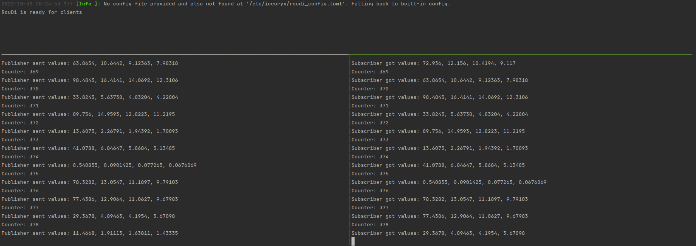

# ice-quaternion
This example showcases two processes that communicate with each other using zero-copy inter-process communication (IPC) on iceoryx.

## Expected Output


## Build and Run

1. First, iceoryx needs to be installed. You can find the build and installation guidelines [here](assets/installation.md).
2. Clone the repository or unzip the file
- Clone
  ```bash
  git clone https://github.com/jonaletil/ice-quaternion.git
  ```
- Unzip
  ```bash
  unzip ice-quaternion.zip
  ```
3. Build (with CMake)  
    - Generate the necessary build files
   ```bash
   cd ice-quaternion
   cmake CMakelist.txt
    ```
    - Compile the source code
   ```bash
   cmake --build .
    ```
4. How to run  
There are two ways you can start/run the processes:
   - **Run sh script (faster way):**
      ```bash
     cd ice-quaternion
     ./run_ice_quaternion.sh 
      ```
   - **or start all processes manually in terminal:**
     1. Start RouDi Daemon in terminal
     ```bash
     iox-roudi
      ```
     2. Start publisher in separate terminal
     ```bash
     cd ice-quaternion
     ./ice-quaternion-publisher
      ```
     3. Start subscriber in separate terminal
     ```bash
     cd ice-quaternion
     ./ice-quaternion-subscriber
      ```
   
